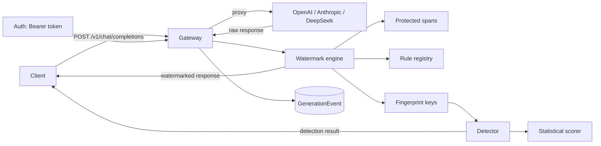
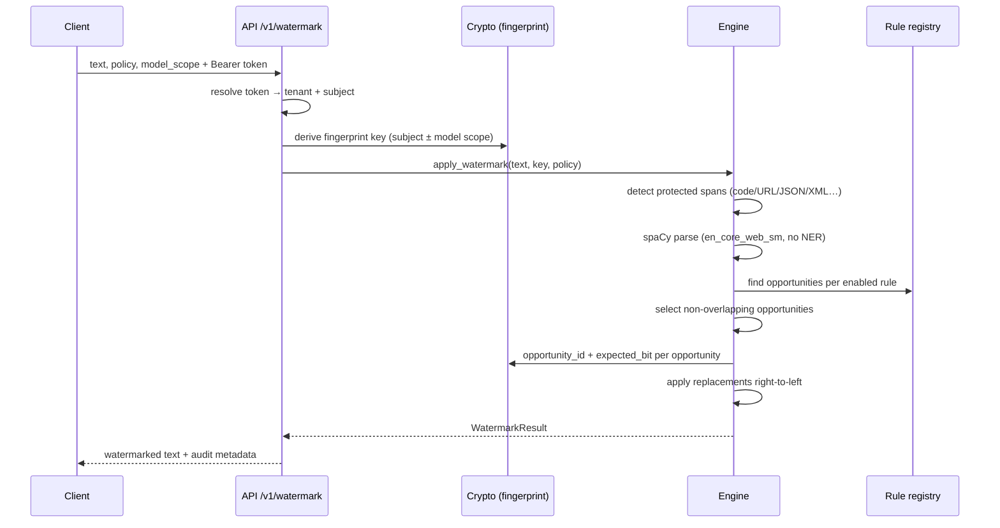
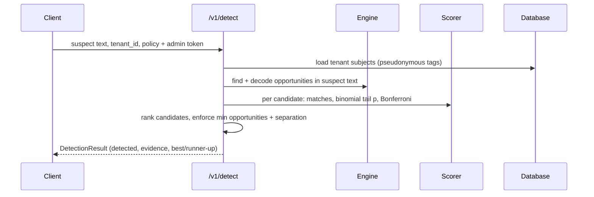

# TraceMark architecture

TraceMark is a modular monolith. Every component is designed so it could be
extracted into its own service later, but V1 deliberately ships as one
FastAPI application with a shared PostgreSQL/SQLite persistence layer.

## System overview



## Request/watermark flow



## Detection flow



## Component responsibilities

### crypto/fingerprint.py

Key derivation is entirely HMAC-SHA256 / HKDF-SHA256 with domain separation:

```
master_key
  └─ HKDF "tracemark/tenant/v1" || tenant_id ──► tenant_secret
        └─ HMAC "subject-tag/v1" || external_ref ──► subject_tag (128-bit, hex)
        └─ HKDF "tracemark/fingerprint/v1" || subject_tag ──► employee_key
              └─ HKDF "tracemark/model-scope/v1" || scope ──► model_key
```

`subject_tag` is pseudonymous and safe to store. Fingerprint keys are never
persisted; they are recomputed on demand.

### watermark/rules/

Each rule implements `TransformRule`:

- `find_opportunities` — locate eligible spans (returns `WatermarkOpportunity`
  with variant 0/1, canonical target, canonical context, occurrence index)
- `normalize_variants` — map both variants onto one canonical form
- `canonicalize_match` — canonical form of a matched span
- `decode_opportunity` — return observed bit (0/1/None)

Rules register themselves into a global `RuleRegistry`. V1 ships:
quotes, apostrophes, ellipsis, dash_style, serial_comma, contractions,
abbreviations, complementizer_that, markdown.

### watermark/opportunities.py

`opportunity_id(rule_id, canonical_sentence, canonical_target, occurrence_index)`
is a SHA-256 over canonical (variant-independent) inputs. This is what makes
IDs stable across encode/decode and across edits: offsets never enter the ID,
and the canonical context is sentence-local.

`canonicalize_for_fingerprinting` normalizes **every** supported variation
regardless of the active policy, so IDs match even when a rule was disabled
at encode time.

### watermark/protection.py

Detects fenced/inline code, URLs, emails, JSON-like blocks, XML, Markdown
links and file paths. Nothing protected is ever modified.

### watermark/engine.py

`apply_watermark` runs protection → spaCy parse → rule opportunity collection →
overlap resolution → opportunity IDs → expected bits → right-to-left
replacements. Overlap resolution is deterministic: policy rule order, then
confidence, then position, then rule id.

### watermark/detector.py + scorer.py

Decodes observed bits, computes per-candidate `matches / opportunities`, then:

- `p = P(X >= matches)` for `X ~ Binomial(n, 0.5)`
- Bonferroni correction over the candidate count
- `evidence = -log10(adjusted p)`
- Attribution requires `usable_opportunities >= minimum` **and** separation
  between best and runner-up. Short documents return `insufficient_evidence`.

### providers/

`ProviderAdapter` protocol with `OpenAICompatibleAdapter` (OpenAI, DeepSeek,
any `/chat/completions` endpoint) and `AnthropicAdapter` (Messages API).
Routing ids like `deepseek/deepseek-chat` map a prefix to a provider and strip
it before the upstream call. A single `httpx.AsyncClient` from the app
lifespan is reused for all upstream calls.

### api/proxy.py

Watermarks only plain natural-language assistant content. JSON mode, tool
calls and code-dominated responses are skipped (and logged as `policy=none`).
`stream=true` is rejected with an explicit error because post-generation
watermarking is incompatible with genuine token streaming.

### db/

`Tenant`, `Subject`, `ApiCredential`, `GenerationEvent`. Master key is never
stored in the database. Generation events store hashes and counts, not raw
content (raw retention is an opt-in dev flag). Same models work on SQLite and
PostgreSQL; Alembic owns schema migrations.

### auth/

API credentials are bound to (tenant, subject). `Authorization: Bearer
<token>` resolves to a subject — a client can never choose another employee's
watermark identity by putting a `subject_id` in the request. Admin endpoints
use a separate development admin token.

## Benchmark system

`benchmarks/` contains a JSONL corpus (8 categories), edit-attack functions,
and a harness that measures opportunity density, attribution, attack
survival, false-positive rate and latency. It never calls an external LLM and
writes `benchmarks/results/metrics.json` plus a rendered Markdown report.

## Design decisions worth noting

- **Sentence-local IDs.** Global offsets would break under any edit; sentence
  canonical context keeps IDs stable under deletion/reordering.
- **Global canonicalizer.** Detection must not depend on which rules were
  enabled at encode time, so canonicalization always normalizes the full rule
  set.
- **Conservative serial comma.** The rule rejects proper-noun conjuncts and
  clause coordination to avoid appositive false positives, at the cost of
  opportunity density in name-heavy text.
- **Explicit streaming limitation.** The API returns a clear error rather than
  faking time-to-first-token. Buffered "sentence-aware streaming" is a future
  feature.
